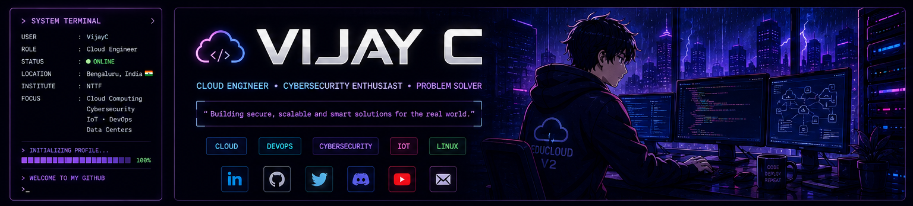

 

<h1>VIJAY C</h1>

<h3>Cloud Computing • Cybersecurity • Linux • DevOps • IoT</h3>

Diploma student in Computer Technology and IT Infrastructure at NTTF. 
Building practical systems using cloud infrastructure, virtualization, Linux, automation and IoT.

---
## 👨‍💻 About Me

<table>
<tr>
<td width="50%">

**Name**  
Vijay C

**Education**  
Diploma in Computer Technology & IT Infrastructure

**Institution**  
NTTF

**Location**  
Bengaluru, India

</td>

<td width="50%">

**Focus Areas**

- Cloud Computing
- Linux Administration
- Cybersecurity
- DevOps
- IoT
- Virtualization

**Current Project**  
EduCloud V2

</td>
</tr>
</table>

I enjoy building practical technology projects that solve real problems. My main interests are cloud infrastructure, Linux, virtualization, secure systems, networking and IoT.
---

## 📊 GitHub Dashboard

  

---
